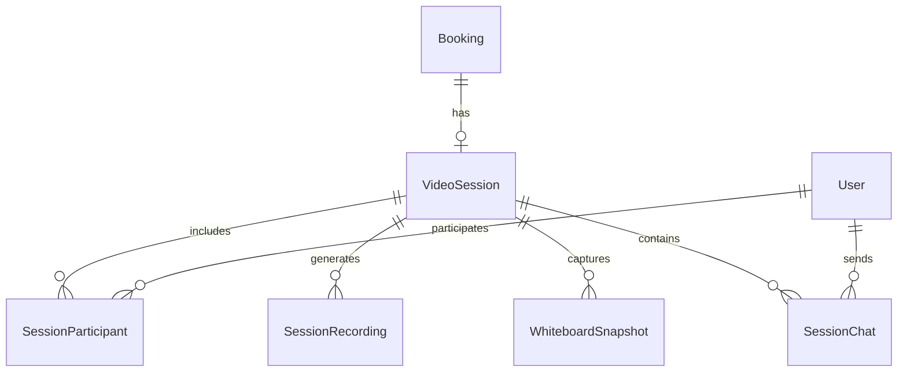

# Video Conferencing Database Schema Documentation

## Overview

This document describes the database schema extensions for the TutEasy video conferencing platform. These models integrate with the existing booking system to provide WebRTC-based video sessions with recording capabilities, interactive whiteboard features, and full compliance with FERPA, COPPA, and GDPR requirements.

## Table of Contents

1. [Core Tables](#core-tables)
2. [Relationships and Foreign Keys](#relationships-and-foreign-keys)
3. [Indexes and Performance](#indexes-and-performance)
4. [Data Retention Policies](#data-retention-policies)
5. [Compliance Considerations](#compliance-considerations)
6. [Migration Strategy](#migration-strategy)

## Core Tables

### 1. video_sessions

**Purpose**: Central table for managing video conferencing sessions linked to bookings.

| Column | Type | Description | Constraints |
|--------|------|-------------|-------------|
| id | UUID | Primary key | PK, Auto-generated |
| bookingId | UUID | Link to booking | FK → bookings.id, UNIQUE |
| roomId | String | Unique room identifier | UNIQUE |
| maxParticipants | Integer | Maximum allowed participants | Default: 2 |
| recordingEnabled | Boolean | Whether recording is allowed | Default: false |
| whiteboardEnabled | Boolean | Whether whiteboard is enabled | Default: true |
| screenShareEnabled | Boolean | Whether screen sharing is allowed | Default: true |
| chatEnabled | Boolean | Whether chat is enabled | Default: true |
| status | Enum | Session state (WAITING/ACTIVE/PAUSED/ENDED/FAILED) | Default: WAITING |
| startedAt | DateTime | When session actually started | Nullable |
| endedAt | DateTime | When session ended | Nullable |
| actualDuration | Integer | Actual session duration in seconds | Nullable |
| qualityMetrics | JSON | Connection quality statistics | Nullable |
| consentObtained | Boolean | Recording consent flag | Default: false |
| parentalConsent | Boolean | COPPA compliance flag | Default: false |
| createdAt | DateTime | Record creation timestamp | Auto-generated |
| updatedAt | DateTime | Last update timestamp | Auto-updated |

**Key Features**:
- One-to-one relationship with bookings
- Tracks session configuration and permissions
- Stores quality metrics for performance analysis
- Includes compliance flags for consent tracking

### 2. session_participants

**Purpose**: Tracks individual participants in video sessions with their roles and metrics.

| Column | Type | Description | Constraints |
|--------|------|-------------|-------------|
| id | UUID | Primary key | PK, Auto-generated |
| sessionId | UUID | Link to video session | FK → video_sessions.id |
| userId | UUID | Link to user | FK → User.id |
| role | Enum | Participant role (HOST/PARTICIPANT/OBSERVER) | Default: PARTICIPANT |
| joinedAt | DateTime | When participant joined | Default: NOW() |
| leftAt | DateTime | When participant left | Nullable |
| connectionQuality | JSON | RTCStats data | Nullable |
| speakingTime | Integer | Total speaking time in seconds | Nullable |
| videoEnabled | Boolean | Video state | Default: true |
| audioEnabled | Boolean | Audio state | Default: true |
| canShare | Boolean | Screen sharing permission | Default: false |
| canRecord | Boolean | Recording permission | Default: false |
| canModerate | Boolean | Moderation permission | Default: false |
| ipAddress | String | IP for audit trail | Nullable |
| userAgent | String | Browser info for debugging | Nullable |

**Key Features**:
- Compound unique constraint on (sessionId, userId)
- Tracks participant permissions and capabilities
- Stores connection quality metrics for troubleshooting
- Includes audit fields for compliance

### 3. session_recordings

**Purpose**: Manages recording metadata, processing status, and storage references.

| Column | Type | Description | Constraints |
|--------|------|-------------|-------------|
| id | UUID | Primary key | PK, Auto-generated |
| sessionId | UUID | Link to video session | FK → video_sessions.id |
| startTime | DateTime | Recording start time | Required |
| endTime | DateTime | Recording end time | Nullable |
| duration | Integer | Duration in seconds | Nullable |
| fileSize | BigInt | File size in bytes | Nullable |
| videoUrl | String | Video file URL | Nullable |
| audioUrl | String | Audio file URL | Nullable |
| whiteboardUrl | String | Whiteboard recording URL | Nullable |
| mergedUrl | String | Combined recording URL | Nullable |
| thumbnailUrl | String | Thumbnail image URL | Nullable |
| storageKey | String | S3/Cloud storage key | Nullable |
| status | Enum | Processing status (UPLOADING/PROCESSING/READY/FAILED/DELETED) | Default: UPLOADING |
| processingError | Text | Error details if processing failed | Nullable |
| processingStartedAt | DateTime | Processing start timestamp | Nullable |
| processingCompletedAt | DateTime | Processing completion timestamp | Nullable |
| resolution | String | Video resolution | Nullable |
| format | String | File format | Default: mp4 |
| frameRate | Integer | Video frame rate | Nullable |
| bitrate | Integer | Video bitrate | Nullable |
| hasVideo | Boolean | Contains video track | Default: true |
| hasAudio | Boolean | Contains audio track | Default: true |
| hasWhiteboard | Boolean | Contains whiteboard data | Default: false |
| hasScreenShare | Boolean | Contains screen share | Default: false |
| consentObtained | Boolean | Recording consent flag | Default: false |
| retentionDate | DateTime | Auto-deletion date | Nullable |
| deletedAt | DateTime | Soft delete timestamp | Nullable |
| accessLogs | JSON | Access event tracking (FERPA) | Nullable |
| lastAccessedAt | DateTime | Last access timestamp | Nullable |

**Key Features**:
- Supports multiple recording formats and sources
- Tracks processing pipeline status
- Implements retention policies with auto-deletion
- Includes access logging for FERPA compliance
- Soft delete capability for recovery

### 4. whiteboard_snapshots

**Purpose**: Stores periodic snapshots of whiteboard state for playback and recovery.

| Column | Type | Description | Constraints |
|--------|------|-------------|-------------|
| id | UUID | Primary key | PK, Auto-generated |
| sessionId | UUID | Link to video session | FK → video_sessions.id |
| timestamp | DateTime | Snapshot timestamp | Required |
| imageUrl | String | Snapshot image URL | Required |
| thumbnailUrl | String | Thumbnail URL | Nullable |
| storageKey | String | S3/Cloud storage key | Nullable |
| revision | Integer | Version number | Required |
| operations | JSON | Array of drawing operations | Nullable |
| canvasData | JSON | Full canvas state | Nullable |
| fileSize | BigInt | File size in bytes | Nullable |
| width | Integer | Canvas width | Nullable |
| height | Integer | Canvas height | Nullable |
| createdAt | DateTime | Creation timestamp | Auto-generated |

**Key Features**:
- Versioned snapshots for history tracking
- Stores both image and operational data
- Enables whiteboard playback and recovery
- Optimized for time-based queries

### 5. session_chat

**Purpose**: Stores chat messages exchanged during video sessions.

| Column | Type | Description | Constraints |
|--------|------|-------------|-------------|
| id | UUID | Primary key | PK, Auto-generated |
| sessionId | UUID | Link to video session | FK → video_sessions.id |
| userId | UUID | Message sender | FK → User.id |
| message | Text | Message content | Required |
| messageType | Enum | Type (TEXT/FILE/IMAGE/SYSTEM/EQUATION) | Default: TEXT |
| attachmentUrl | String | File attachment URL | Nullable |
| attachmentName | String | Attachment filename | Nullable |
| attachmentSize | BigInt | Attachment size in bytes | Nullable |
| attachmentType | String | MIME type | Nullable |
| editedAt | DateTime | Edit timestamp | Nullable |
| deletedAt | DateTime | Soft delete timestamp | Nullable |
| isSystemMessage | Boolean | System-generated flag | Default: false |
| createdAt | DateTime | Creation timestamp | Auto-generated |
| updatedAt | DateTime | Last update timestamp | Auto-updated |

**Key Features**:
- Supports multiple message types including equations
- File attachment support with metadata
- Edit and soft delete capabilities
- System message support for notifications

## Relationships and Foreign Keys

### Primary Relationships



### Foreign Key Constraints

1. **video_sessions.bookingId** → bookings.id (CASCADE DELETE)
   - Ensures video session is deleted when booking is deleted
   - One-to-one relationship enforced by UNIQUE constraint

2. **session_participants.sessionId** → video_sessions.id (CASCADE DELETE)
   - Removes participant records when session is deleted
   - Maintains referential integrity

3. **session_participants.userId** → User.id (CASCADE DELETE)
   - Removes participant records when user is deleted
   - Ensures no orphaned participant records

4. **session_recordings.sessionId** → video_sessions.id (CASCADE DELETE)
   - Cascades deletion to recordings
   - Note: Actual files need separate cleanup

5. **whiteboard_snapshots.sessionId** → video_sessions.id (CASCADE DELETE)
   - Removes snapshots with session
   - Prevents orphaned whiteboard data

6. **session_chat.sessionId** → video_sessions.id (CASCADE DELETE)
   - Deletes chat history with session
   - Maintains data consistency

7. **session_chat.userId** → User.id (CASCADE DELETE)
   - Preserves chat integrity on user deletion
   - Consider soft delete for audit trail

## Indexes and Performance

### Primary Indexes

| Table | Index | Type | Purpose |
|-------|-------|------|---------|
| video_sessions | bookingId | UNIQUE | Fast booking lookups |
| video_sessions | roomId | UNIQUE | Room ID queries |
| video_sessions | status | BTREE | Status filtering |
| video_sessions | startedAt | BTREE | Time-based queries |
| session_participants | (sessionId, userId) | UNIQUE | Prevent duplicates |
| session_participants | sessionId | BTREE | Session queries |
| session_participants | userId | BTREE | User history |
| session_participants | joinedAt | BTREE | Time-based analytics |
| session_recordings | sessionId | BTREE | Session recordings |
| session_recordings | status | BTREE | Processing pipeline |
| session_recordings | retentionDate | BTREE | Cleanup queries |
| whiteboard_snapshots | sessionId | BTREE | Session snapshots |
| whiteboard_snapshots | timestamp | BTREE | Time-based playback |
| whiteboard_snapshots | revision | BTREE | Version queries |
| session_chat | sessionId | BTREE | Message retrieval |
| session_chat | userId | BTREE | User messages |
| session_chat | createdAt | BTREE | Chronological order |

### Performance Considerations

1. **Composite Indexes**: The (sessionId, userId) composite index on session_participants optimizes participant lookup queries.

2. **Time-based Indexes**: Multiple timestamp indexes support efficient time-range queries for analytics and playback.

3. **Status Indexes**: Enable quick filtering of active sessions and processing states.

4. **JSON Fields**: qualityMetrics, connectionQuality, and accessLogs use JSONB for efficient querying in PostgreSQL.

## Data Retention Policies

### Retention Rules

| Data Type | Default Retention | Configurable | Notes |
|-----------|------------------|--------------|-------|
| Video Sessions | 1 year | Yes | Metadata only |
| Session Recordings | 90 days | Yes, per institution | Auto-delete after retention |
| Whiteboard Snapshots | 30 days | Yes | Compressed after 7 days |
| Chat Messages | 1 year | Yes | Soft delete available |
| Participant Data | 1 year | No | For analytics |
| Quality Metrics | 90 days | No | For troubleshooting |

### Implementation Strategy

```sql
-- Example cleanup query for recordings
DELETE FROM session_recordings 
WHERE retentionDate < NOW() 
  AND status = 'READY'
  AND deletedAt IS NULL;

-- Archive old sessions
UPDATE video_sessions 
SET qualityMetrics = NULL 
WHERE endedAt < NOW() - INTERVAL '90 days';
```

### Storage Lifecycle

1. **Hot Storage** (0-7 days): Immediate access for recent sessions
2. **Warm Storage** (7-30 days): Compressed, quick retrieval
3. **Cold Storage** (30+ days): Archived, slower access
4. **Deletion**: Automatic after retention period

## Compliance Considerations

### FERPA Compliance

1. **Access Logging**: The `accessLogs` field in session_recordings tracks all access events
2. **Audit Trail**: IP address and user agent tracking in session_participants
3. **Educational Records**: Proper cascading deletes maintain data integrity
4. **Parent Access**: Parental consent flags for minor students

### COPPA Compliance

1. **Parental Consent**: `parentalConsent` flag in video_sessions
2. **Age Verification**: Integration with User role system
3. **Limited Data Collection**: Minimal data storage for minors
4. **Deletion Rights**: Soft delete support for recovery

### GDPR Compliance

1. **Right to Erasure**: Cascading deletes and soft delete support
2. **Data Portability**: JSON export capabilities
3. **Consent Tracking**: Multiple consent flags throughout schema
4. **Access Rights**: Comprehensive access logging

## Migration Strategy

### Phase 1: Schema Creation
```bash
# Generate migration
npx prisma migrate dev --name add_video_conferencing_models

# Apply to production
npx prisma migrate deploy
```

### Phase 2: Data Migration
```sql
-- Migrate existing booking meeting data
UPDATE bookings b
SET videoSessionId = (
  SELECT id FROM video_sessions vs 
  WHERE vs.bookingId = b.id
)
WHERE b.meetingUrl IS NOT NULL;
```

### Phase 3: Deprecation
```sql
-- After verification, remove deprecated columns
ALTER TABLE bookings 
  DROP COLUMN meetingUrl,
  DROP COLUMN meetingId,
  DROP COLUMN meetingPassword;
```

### Rollback Plan

```sql
-- Rollback script if needed
DROP TABLE IF EXISTS session_chat CASCADE;
DROP TABLE IF EXISTS whiteboard_snapshots CASCADE;
DROP TABLE IF EXISTS session_recordings CASCADE;
DROP TABLE IF EXISTS session_participants CASCADE;
DROP TABLE IF EXISTS video_sessions CASCADE;

DROP TYPE IF EXISTS ChatMessageType;
DROP TYPE IF EXISTS RecordingStatus;
DROP TYPE IF EXISTS ParticipantRole;
DROP TYPE IF EXISTS VideoSessionStatus;
```

## Monitoring and Maintenance

### Key Metrics to Monitor

1. **Table Growth**: Monitor row counts and storage size
2. **Index Usage**: Verify indexes are being utilized
3. **Query Performance**: Track slow queries on video tables
4. **Retention Compliance**: Ensure cleanup jobs are running

### Maintenance Tasks

```sql
-- Weekly: Analyze tables for query optimization
ANALYZE video_sessions, session_participants, session_recordings;

-- Daily: Clean up expired recordings
DELETE FROM session_recordings 
WHERE retentionDate < CURRENT_DATE;

-- Monthly: Archive old session data
INSERT INTO archived_sessions 
SELECT * FROM video_sessions 
WHERE endedAt < CURRENT_DATE - INTERVAL '1 year';
```

## Conclusion

This schema provides a robust foundation for the video conferencing platform with:

- **Scalability**: Efficient indexing and partitioning strategies
- **Compliance**: Built-in support for FERPA, COPPA, and GDPR
- **Performance**: Optimized for real-time operations
- **Maintainability**: Clear relationships and retention policies
- **Integration**: Seamless connection with existing booking system

The schema is designed to handle the expected load while maintaining data integrity and regulatory compliance.