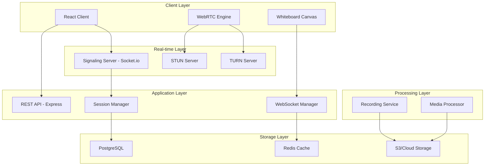
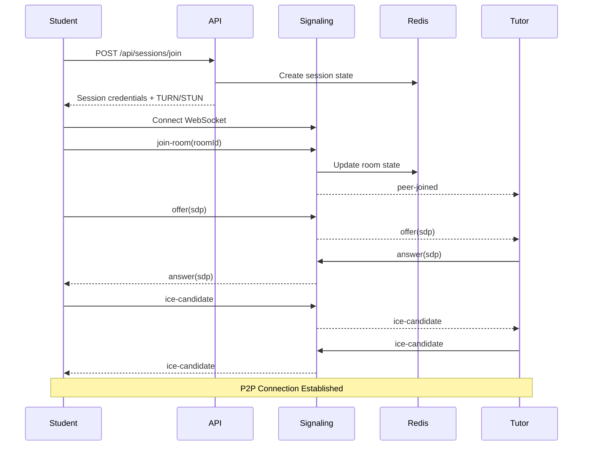
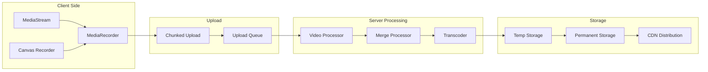

# TutEasy Video Conferencing Platform Architecture

## Executive Summary

This document outlines the comprehensive technical architecture for implementing an internal video conferencing platform with interactive whiteboard capabilities for TutEasy. The solution replaces external Zoom integration with a WebRTC-based system providing MyTutor-level features while ensuring FERPA/COPPA/GDPR compliance.

## Table of Contents

1. [System Overview](#system-overview)
2. [Core Components](#core-components)
3. [WebRTC Architecture](#webrtc-architecture)
4. [Whiteboard System Architecture](#whiteboard-system-architecture)
5. [Session Recording Architecture](#session-recording-architecture)
6. [Database Schema Extensions](#database-schema-extensions)
7. [API Architecture](#api-architecture)
8. [Frontend Architecture](#frontend-architecture)
9. [Security & Compliance](#security--compliance)
10. [Integration Points](#integration-points)
11. [Deployment Architecture](#deployment-architecture)
12. [Performance Considerations](#performance-considerations)

## System Overview

### High-Level Architecture



### Technology Stack

- **WebRTC**: Peer-to-peer video/audio communication
- **Socket.io**: Real-time signaling and whiteboard synchronization
- **Canvas API**: Interactive whiteboard implementation
- **MediaRecorder API**: Client-side recording capabilities
- **FFmpeg**: Server-side media processing
- **Redis**: Session state and real-time data caching
- **PostgreSQL**: Persistent data storage
- **AWS S3/CloudFlare R2**: Recording and file storage

## Core Components

### 1. Video Conferencing Service

```typescript
// backend/src/services/videoConference.service.ts
interface VideoConferenceService {
  createSession(bookingId: string): Promise<VideoSession>;
  joinSession(sessionId: string, userId: string): Promise<SessionCredentials>;
  endSession(sessionId: string): Promise<void>;
  getSessionState(sessionId: string): Promise<SessionState>;
  updateSessionSettings(sessionId: string, settings: SessionSettings): Promise<void>;
}

interface VideoSession {
  id: string;
  bookingId: string;
  roomId: string;
  participants: Participant[];
  startTime: Date;
  endTime?: Date;
  recordingEnabled: boolean;
  whiteboardEnabled: boolean;
  screenShareEnabled: boolean;
  status: SessionStatus;
  turnCredentials?: TurnCredentials;
  stunServers: string[];
}
```

### 2. Signaling Server

```typescript
// backend/src/services/signaling.service.ts
interface SignalingEvents {
  // Connection events
  'join-room': (roomId: string, userId: string) => void;
  'leave-room': (roomId: string, userId: string) => void;
  
  // WebRTC signaling
  'offer': (offer: RTCSessionDescriptionInit, targetId: string) => void;
  'answer': (answer: RTCSessionDescriptionInit, targetId: string) => void;
  'ice-candidate': (candidate: RTCIceCandidateInit, targetId: string) => void;
  
  // Media control
  'toggle-video': (enabled: boolean) => void;
  'toggle-audio': (enabled: boolean) => void;
  'start-screen-share': () => void;
  'stop-screen-share': () => void;
  
  // Session control
  'start-recording': () => void;
  'stop-recording': () => void;
  'session-ended': () => void;
}
```

### 3. Whiteboard Service

```typescript
// backend/src/services/whiteboard.service.ts
interface WhiteboardService {
  createWhiteboard(sessionId: string): Promise<Whiteboard>;
  syncDrawing(sessionId: string, drawingData: DrawingData): Promise<void>;
  getWhiteboardState(sessionId: string): Promise<WhiteboardState>;
  saveSnapshot(sessionId: string): Promise<string>;
  clearWhiteboard(sessionId: string): Promise<void>;
}

interface DrawingData {
  type: 'path' | 'text' | 'shape' | 'equation' | 'image';
  data: any;
  userId: string;
  timestamp: number;
  sequenceNumber: number;
}
```

## WebRTC Architecture

### Signaling Flow



### STUN/TURN Configuration

```typescript
// backend/src/config/webrtc.config.ts
export const webRTCConfig = {
  iceServers: [
    // Public STUN servers for development
    { urls: 'stun:stun.l.google.com:19302' },
    { urls: 'stun:stun1.l.google.com:19302' },
    
    // Self-hosted TURN server for production
    {
      urls: 'turn:turn.tuteasy.com:3478',
      username: 'dynamically-generated',
      credential: 'time-limited-credential'
    },
    {
      urls: 'turns:turn.tuteasy.com:5349',
      username: 'dynamically-generated',
      credential: 'time-limited-credential'
    }
  ],
  
  iceTransportPolicy: 'all',
  bundlePolicy: 'max-bundle',
  rtcpMuxPolicy: 'require'
};
```

### Media Constraints

```typescript
// frontend/src/services/webrtc.service.ts
const mediaConstraints = {
  video: {
    width: { min: 640, ideal: 1280, max: 1920 },
    height: { min: 480, ideal: 720, max: 1080 },
    frameRate: { ideal: 30, max: 30 },
    facingMode: 'user'
  },
  audio: {
    echoCancellation: true,
    noiseSuppression: true,
    autoGainControl: true,
    sampleRate: 48000
  }
};
```

## Whiteboard System Architecture

### Real-time Synchronization Protocol

```typescript
// Collaborative Editing with Operational Transformation
interface WhiteboardSync {
  // Client-to-Server operations
  sendOperation(op: Operation): void;
  
  // Server-to-Client operations
  receiveOperation(op: Operation): void;
  
  // Conflict resolution
  transformOperation(op1: Operation, op2: Operation): Operation;
  
  // State synchronization
  requestStateSync(): void;
  applyStateSync(state: WhiteboardState): void;
}

interface Operation {
  id: string;
  type: OperationType;
  data: any;
  userId: string;
  timestamp: number;
  revision: number;
  parentRevision: number;
}
```

### Whiteboard Features

1. **Drawing Tools**
   - Pen/Pencil with pressure sensitivity
   - Eraser with variable size
   - Shapes (rectangle, circle, line, arrow)
   - Text input with formatting
   - Color picker and stroke width

2. **Mathematical Notation**
   - LaTeX equation rendering
   - Mathematical symbol palette
   - Graph plotting capabilities
   - Geometry tools (ruler, protractor)

3. **Collaboration Features**
   - Real-time cursor tracking
   - User color coding
   - Undo/Redo with history
   - Layer management
   - Object selection and manipulation

### Canvas Rendering Architecture

```typescript
// frontend/src/components/Whiteboard/WhiteboardCanvas.tsx
class WhiteboardCanvas {
  private canvas: HTMLCanvasElement;
  private ctx: CanvasRenderingContext2D;
  private offscreenCanvas: OffscreenCanvas;
  private drawingBuffer: DrawCommand[];
  private syncEngine: WhiteboardSyncEngine;
  
  // Optimized rendering pipeline
  renderFrame(): void {
    // Batch drawing operations
    this.batchDrawCommands();
    
    // Render to offscreen canvas
    this.renderToOffscreen();
    
    // Copy to main canvas
    this.ctx.drawImage(this.offscreenCanvas, 0, 0);
    
    // Send changes to sync engine
    this.syncEngine.pushChanges(this.drawingBuffer);
    
    // Clear buffer
    this.drawingBuffer = [];
  }
  
  // Handle <50ms latency requirement
  optimizeForLatency(): void {
    // Use requestAnimationFrame for smooth rendering
    // Implement predictive drawing for local user
    // Use WebWorkers for heavy computations
    // Implement canvas virtualization for large boards
  }
}
```

## Session Recording Architecture

### Recording Pipeline



### Recording Service Implementation

```typescript
// backend/src/services/recording.service.ts
interface RecordingService {
  startRecording(sessionId: string): Promise<RecordingSession>;
  stopRecording(sessionId: string): Promise<RecordingResult>;
  pauseRecording(sessionId: string): Promise<void>;
  resumeRecording(sessionId: string): Promise<void>;
  
  // Chunked upload handling
  uploadChunk(sessionId: string, chunk: Buffer, chunkIndex: number): Promise<void>;
  finalizeUpload(sessionId: string): Promise<void>;
  
  // Processing pipeline
  processRecording(recordingId: string): Promise<ProcessedRecording>;
  mergeStreams(videoStream: string, audioStream: string, whiteboardStream: string): Promise<string>;
  
  // Playback
  getRecordingUrl(recordingId: string): Promise<string>;
  generateThumbnail(recordingId: string): Promise<string>;
  getRecordingMetadata(recordingId: string): Promise<RecordingMetadata>;
}

interface RecordingMetadata {
  duration: number;
  fileSize: number;
  resolution: string;
  participants: string[];
  hasWhiteboard: boolean;
  hasScreenShare: boolean;
  chapters?: RecordingChapter[];
}
```

### Storage Strategy

```typescript
// Recording storage lifecycle
enum StorageTier {
  HOT = 'hot',      // Immediate access (0-7 days)
  WARM = 'warm',    // Quick access (7-30 days)
  COLD = 'cold',    // Archived (30+ days)
}

interface StorageStrategy {
  // Initial storage in hot tier
  uploadPath: 's3://tuteasy-recordings-hot/{sessionId}/{timestamp}/';
  
  // Lifecycle rules
  tieringRules: {
    hotToWarm: 7,  // days
    warmToCold: 30, // days
    deleteAfter: 365 // days (configurable per institution)
  };
  
  // CDN configuration for playback
  cdnDistribution: 'CloudFront or CloudFlare';
  
  // Backup strategy
  backupEnabled: true;
  backupRegion: 'us-west-2';
}
```

## Database Schema Extensions

### New Tables and Modifications

```prisma
// Add to backend/prisma/schema.prisma

model VideoSession {
  id                String              @id @default(uuid())
  bookingId         String              @unique
  booking           Booking             @relation(fields: [bookingId], references: [id])
  roomId            String              @unique
  
  // Session configuration
  maxParticipants   Int                 @default(2)
  recordingEnabled  Boolean             @default(false)
  whiteboardEnabled Boolean             @default(true)
  screenShareEnabled Boolean            @default(true)
  chatEnabled       Boolean             @default(true)
  
  // Session state
  status            VideoSessionStatus  @default(WAITING)
  startedAt         DateTime?
  endedAt           DateTime?
  actualDuration    Int?               // in seconds
  
  // Participants
  participants      SessionParticipant[]
  
  // Recording reference
  recordings        SessionRecording[]
  
  // Whiteboard snapshots
  whiteboardData    Json?              // Final whiteboard state
  whiteboardSnapshots WhiteboardSnapshot[]
  
  // Analytics
  qualityMetrics    Json?              // Connection quality stats
  
  createdAt         DateTime           @default(now())
  updatedAt         DateTime           @updatedAt
  
  @@index([bookingId])
  @@index([roomId])
  @@index([status])
}

enum VideoSessionStatus {
  WAITING
  ACTIVE
  PAUSED
  ENDED
  FAILED
}

model SessionParticipant {
  id              String          @id @default(uuid())
  sessionId       String
  session         VideoSession    @relation(fields: [sessionId], references: [id])
  userId          String
  user            User            @relation(fields: [userId], references: [id])
  
  role            ParticipantRole @default(PARTICIPANT)
  joinedAt        DateTime        @default(now())
  leftAt          DateTime?
  
  // Participant metrics
  connectionQuality Json?         // RTCStats data
  speakingTime    Int?           // in seconds
  
  @@unique([sessionId, userId])
  @@index([sessionId])
  @@index([userId])
}

enum ParticipantRole {
  HOST
  PARTICIPANT
  OBSERVER
}

model SessionRecording {
  id              String          @id @default(uuid())
  sessionId       String
  session         VideoSession    @relation(fields: [sessionId], references: [id])
  
  // Recording details
  startTime       DateTime
  endTime         DateTime
  duration        Int             // in seconds
  fileSize        BigInt          // in bytes
  
  // Storage references
  videoUrl        String?
  audioUrl        String?
  whiteboardUrl   String?
  mergedUrl       String?         // Combined recording
  thumbnailUrl    String?
  
  // Processing status
  status          RecordingStatus @default(PROCESSING)
  processingError String?
  
  // Metadata
  resolution      String?
  format          String          @default("mp4")
  hasVideo        Boolean         @default(true)
  hasAudio        Boolean         @default(true)
  hasWhiteboard   Boolean         @default(false)
  hasScreenShare  Boolean         @default(false)
  
  // Privacy & Compliance
  consentObtained Boolean         @default(false)
  retentionDate   DateTime?       // When to auto-delete
  
  createdAt       DateTime        @default(now())
  updatedAt       DateTime        @updatedAt
  
  @@index([sessionId])
  @@index([status])
}

enum RecordingStatus {
  UPLOADING
  PROCESSING
  READY
  FAILED
  DELETED
}

model WhiteboardSnapshot {
  id              String          @id @default(uuid())
  sessionId       String
  session         VideoSession    @relation(fields: [sessionId], references: [id])
  
  timestamp       DateTime
  imageUrl        String
  thumbnailUrl    String
  revision        Int
  
  createdAt       DateTime        @default(now())
  
  @@index([sessionId])
  @@index([timestamp])
}

// Update existing Booking model
model Booking {
  // ... existing fields ...
  
  // Add video session reference
  videoSession    VideoSession?
  
  // Remove old meeting fields in favor of video session
  // meetingUrl, meetingId, meetingPassword will be deprecated
}

// Add to User model for participant tracking
model User {
  // ... existing fields ...
  
  sessionParticipations SessionParticipant[]
}
```

## API Architecture

### REST API Endpoints

```typescript
// Video Conference API Routes
router.post('/api/video-sessions/create', createVideoSession);
router.post('/api/video-sessions/:sessionId/join', joinVideoSession);
router.post('/api/video-sessions/:sessionId/leave', leaveVideoSession);
router.get('/api/video-sessions/:sessionId/status', getSessionStatus);
router.post('/api/video-sessions/:sessionId/end', endVideoSession);

// Recording API Routes
router.post('/api/video-sessions/:sessionId/recording/start', startRecording);
router.post('/api/video-sessions/:sessionId/recording/stop', stopRecording);
router.post('/api/video-sessions/:sessionId/recording/upload', uploadRecordingChunk);
router.get('/api/recordings/:recordingId', getRecording);
router.get('/api/recordings/:recordingId/playback-url', getPlaybackUrl);

// Whiteboard API Routes
router.get('/api/video-sessions/:sessionId/whiteboard/state', getWhiteboardState);
router.post('/api/video-sessions/:sessionId/whiteboard/snapshot', saveWhiteboardSnapshot);
router.get('/api/video-sessions/:sessionId/whiteboard/history', getWhiteboardHistory);

// TURN Credentials API
router.get('/api/video-sessions/turn-credentials', getTurnCredentials);
```

### WebSocket Events

```typescript
// Socket.io namespace structure
io.of('/video').on('connection', (socket) => {
  // Room management
  socket.on('join-room', handleJoinRoom);
  socket.on('leave-room', handleLeaveRoom);
  
  // WebRTC signaling
  socket.on('offer', handleOffer);
  socket.on('answer', handleAnswer);
  socket.on('ice-candidate', handleIceCandidate);
  
  // Media control
  socket.on('toggle-video', handleToggleVideo);
  socket.on('toggle-audio', handleToggleAudio);
  socket.on('start-screen-share', handleStartScreenShare);
  socket.on('stop-screen-share', handleStopScreenShare);
});

io.of('/whiteboard').on('connection', (socket) => {
  // Whiteboard synchronization
  socket.on('draw-operation', handleDrawOperation);
  socket.on('clear-whiteboard', handleClearWhiteboard);
  socket.on('undo', handleUndo);
  socket.on('redo', handleRedo);
  socket.on('cursor-move', handleCursorMove);
  socket.on('request-state', handleStateRequest);
});
```

## Frontend Architecture

### Component Structure

```typescript
// frontend/src/components/VideoConference/
├── VideoConferenceContainer.tsx    // Main container
├── VideoGrid/
│   ├── VideoGrid.tsx               // Grid layout manager
│   ├── VideoTile.tsx               // Individual video tile
│   └── VideoControls.tsx           // Media controls
├── Whiteboard/
│   ├── WhiteboardCanvas.tsx        // Main canvas component
│   ├── DrawingTools.tsx            // Tool palette
│   ├── MathTools.tsx               // Math equation tools
│   └── WhiteboardSync.tsx          // Sync engine
├── Chat/
│   ├── ChatPanel.tsx               // Chat interface
│   ├── MessageList.tsx             // Message display
│   └── MessageInput.tsx            // Input component
├── Recording/
│   ├── RecordingIndicator.tsx      // Recording status
│   └── RecordingControls.tsx       // Start/stop controls
└── hooks/
    ├── useWebRTC.ts                // WebRTC management
    ├── useWhiteboard.ts            // Whiteboard state
    ├── useRecording.ts             // Recording logic
    └── useVideoSession.ts          // Session management
```

### State Management

```typescript
// frontend/src/stores/videoConferenceStore.ts
import { create } from 'zustand';

interface VideoConferenceState {
  // Session state
  sessionId: string | null;
  roomId: string | null;
  status: VideoSessionStatus;
  
  // Participants
  participants: Map<string, Participant>;
  localStream: MediaStream | null;
  remoteStreams: Map<string, MediaStream>;
  
  // Media states
  isVideoEnabled: boolean;
  isAudioEnabled: boolean;
  isScreenSharing: boolean;
  
  // Recording state
  isRecording: boolean;
  recordingStartTime: Date | null;
  
  // Whiteboard state
  isWhiteboardActive: boolean;
  whiteboardRevision: number;
  
  // Actions
  initializeSession: (bookingId: string) => Promise<void>;
  joinSession: () => Promise<void>;
  leaveSession: () => Promise<void>;
  toggleVideo: () => void;
  toggleAudio: () => void;
  startScreenShare: () => Promise<void>;
  stopScreenShare: () => void;
  startRecording: () => Promise<void>;
  stopRecording: () => Promise<void>;
}
```

### WebRTC Service Implementation

```typescript
// frontend/src/services/webrtc.service.ts
export class WebRTCService {
  private pc: RTCPeerConnection | null = null;
  private localStream: MediaStream | null = null;
  private socket: Socket;
  
  async initialize(configuration: RTCConfiguration): Promise<void> {
    this.pc = new RTCPeerConnection(configuration);
    
    // Setup event handlers
    this.pc.onicecandidate = this.handleIceCandidate;
    this.pc.ontrack = this.handleRemoteTrack;
    this.pc.onconnectionstatechange = this.handleConnectionStateChange;
    
    // Get user media
    this.localStream = await navigator.mediaDevices.getUserMedia(mediaConstraints);
    
    // Add tracks to peer connection
    this.localStream.getTracks().forEach(track => {
      this.pc!.addTrack(track, this.localStream!);
    });
  }
  
  async createOffer(): Promise<RTCSessionDescriptionInit> {
    const offer = await this.pc!.createOffer({
      offerToReceiveAudio: true,
      offerToReceiveVideo: true
    });
    await this.pc!.setLocalDescription(offer);
    return offer;
  }
  
  async handleAnswer(answer: RTCSessionDescriptionInit): Promise<void> {
    await this.pc!.setRemoteDescription(answer);
  }
  
  async addIceCandidate(candidate: RTCIceCandidateInit): Promise<void> {
    await this.pc!.addIceCandidate(candidate);
  }
  
  // Adaptive bitrate based on network conditions
  async adaptBitrate(): Promise<void> {
    const stats = await this.pc!.getStats();
    // Implement adaptive bitrate logic
  }
}
```

## Security & Compliance

### FERPA Compliance

1. **Data Privacy**
   - All video sessions are encrypted end-to-end
   - Recordings are stored with encryption at rest
   - Access controls enforce educational record privacy
   - Parent consent required for users under 13

2. **Audit Logging**
   ```typescript
   interface VideoSessionAudit {
     sessionId: string;
     action: 'created' | 'joined' | 'left' | 'recorded' | 'accessed';
     userId: string;
     timestamp: Date;
     metadata: {
       ipAddress?: string;
       userAgent?: string;
       permissions?: string[];
     };
   }
   ```

3. **Data Retention**
   - Configurable retention policies per institution
   - Automatic deletion after retention period
   - Export capabilities for compliance requests

### COPPA Compliance

1. **Parental Consent**
   - Required for users under 13
   - Consent tracking in database
   - Limited data collection for minors

2. **Age Verification**
   ```typescript
   interface AgeVerification {
     requiresParentalConsent(userId: string): Promise<boolean>;
     hasParentalConsent(userId: string): Promise<boolean>;
     restrictFeatures(userId: string): Promise<FeatureRestrictions>;
   }
   ```

### GDPR Compliance

1. **Data Rights**
   - Right to access recordings
   - Right to deletion
   - Data portability for recordings
   - Consent management

2. **Privacy Controls**
   ```typescript
   interface PrivacyControls {
     blurBackground: boolean;
     hideNonParticipants: boolean;
     anonymizeRecording: boolean;
     autoDeleteAfterDays: number;
   }
   ```

### Security Measures

1. **Authentication & Authorization**
   - JWT tokens for session access
   - Role-based access control
   - Session-specific tokens with expiry

2. **Encryption**
   - DTLS for WebRTC media streams
   - TLS 1.3 for signaling
   - AES-256 for stored recordings
   - Encrypted whiteboard data transmission

3. **Rate Limiting & DDoS Protection**
   ```typescript
   const rateLimits = {
     sessionCreation: '5/hour/user',
     sessionJoin: '10/hour/user',
     recordingUpload: '100MB/minute',
     whiteboardOperations: '100/second/user'
   };
   ```

## Integration Points

### Existing Booking System Integration

```typescript
// Modify booking.service.ts
async confirmBooking(bookingId: string, confirmData: ConfirmBookingRequest): Promise<BookingResponse> {
  // ... existing code ...
  
  // Create video session instead of external meeting
  const videoSession = await this.videoConferenceService.createSession(bookingId);
  
  // Update booking with session reference
  const confirmedBooking = await this.prisma.booking.update({
    where: { id: bookingId },
    data: {
      status: BookingStatus.CONFIRMED,
      confirmedAt: new Date(),
      videoSessionId: videoSession.id,
      // Deprecated: meetingUrl, meetingId, meetingPassword
    }
  });
  
  // Send session credentials to participants
  await this.notificationService.sendSessionDetails(confirmedBooking, videoSession);
  
  return this.formatBookingResponse(confirmedBooking);
}
```

### Payment System Integration

```typescript
// Recording storage costs calculation
interface StorageBilling {
  calculateStorageCost(recordingId: string): Promise<BillingItem>;
  applyStorageQuota(userId: string, fileSize: number): Promise<QuotaResult>;
  generateStorageInvoice(userId: string, period: BillingPeriod): Promise<Invoice>;
}
```

### Notification System Integration

```typescript
// Video session notifications
interface VideoSessionNotifications {
  sendSessionReminder(booking: Booking, minutes: number): Promise<void>;
  sendSessionStarted(sessionId: string): Promise<void>;
  sendRecordingAvailable(recordingId: string): Promise<void>;
  sendSessionEnded(sessionId: string, summary: SessionSummary): Promise<void>;
}
```

## Deployment Architecture

### Infrastructure Requirements

```yaml
# kubernetes/video-conference-deployment.yaml
apiVersion: apps/v1
kind: Deployment
metadata:
  name: video-conference-service
spec:
  replicas: 3
  selector:
    matchLabels:
      app: video-conference
  template:
    spec:
      containers:
      - name: signaling-server
        image: tuteasy/signaling-server:latest
        ports:
        - containerPort: 3001
        resources:
          requests:
            memory: "512Mi"
            cpu: "500m"
          limits:
            memory: "1Gi"
            cpu: "1000m"
      
      - name: recording-processor
        image: tuteasy/recording-processor:latest
        ports:
        - containerPort: 3002
        resources:
          requests:
            memory: "1Gi"
            cpu: "1000m"
          limits:
            memory: "2Gi"
            cpu: "2000m"
```

### TURN Server Deployment

```yaml
# coturn configuration
listening-port=3478
tls-listening-port=5349
fingerprint
use-auth-secret
static-auth-secret=your-secret-here
realm=tuteasy.com
total-quota=100
bps-quota=0
stale-nonce=600
cert=/etc/coturn/certs/turn.pem
pkey=/etc/coturn/certs/turn.key
log-file=/var/log/coturn.log
no-stdout-log
```

### CDN Configuration

```typescript
// CloudFlare/CloudFront configuration
const cdnConfig = {
  recordingDistribution: {
    origins: ['s3://tuteasy-recordings'],
    behaviors: {
      '/recordings/*': {
        ttl: 86400,
        compress: true,
        allowedMethods: ['GET', 'HEAD'],
        viewerProtocolPolicy: 'https-only',
        signedUrls: true,
        signedUrlExpiry: 3600
      }
    }
  }
};
```

## Performance Considerations

### Optimization Strategies

1. **Network Optimization**
   - Adaptive bitrate for video quality
   - Simulcast for multiple quality streams
   - Bandwidth estimation and management
   - Regional TURN server deployment

2. **Frontend Performance**
   - Virtual DOM optimization for video grid
   - Canvas virtualization for large whiteboards
   - WebWorker for heavy computations
   - Lazy loading of components

3. **Backend Performance**
   - Redis caching for session state
   - Database query optimization
   - Horizontal scaling with Kubernetes
   - Load balancing with sticky sessions

4. **Recording Optimization**
   - Client-side compression before upload
   - Chunked upload with resume capability
   - Background processing with job queues
   - CDN distribution for playback

### Monitoring & Metrics

```typescript
interface PerformanceMetrics {
  // WebRTC metrics
  connectionEstablishmentTime: number;
  averageRTT: number;
  packetLossRate: number;
  jitter: number;
  videoFrameRate: number;
  audioBitrate: number;
  
  // Whiteboard metrics
  drawingLatency: number;
  syncDelay: number;
  operationsPerSecond: number;
  
  // Recording metrics
  uploadSpeed: number;
  processingTime: number;
  storageUsed: number;
  
  // System metrics
  cpuUsage: number;
  memoryUsage: number;
  concurrentSessions: number;
  activeUsers: number;
}
```

## Implementation Roadmap

### Phase 1: Core Video Conferencing (Weeks 1-4)
- [ ] Setup WebRTC signaling server
- [ ] Implement basic peer-to-peer video calls
- [ ] Integrate with existing booking system
- [ ] Deploy STUN/TURN servers

### Phase 2: Whiteboard Integration (Weeks 5-8)
- [ ] Implement canvas-based whiteboard
- [ ] Add real-time synchronization
- [ ] Implement drawing tools
- [ ] Add mathematical notation support

### Phase 3: Recording Capabilities (Weeks 9-12)
- [ ] Implement client-side recording
- [ ] Setup upload pipeline
- [ ] Implement server-side processing
- [ ] Add playback interface

### Phase 4: Advanced Features (Weeks 13-16)
- [ ] Screen sharing
- [ ] Text chat
- [ ] File sharing
- [ ] Session analytics

### Phase 5: Compliance & Security (Weeks 17-20)
- [ ] FERPA compliance implementation
- [ ] COPPA parental controls
- [ ] GDPR data management
- [ ] Security audit and penetration testing

### Phase 6: Performance & Scale (Weeks 21-24)
- [ ] Performance optimization
- [ ] Load testing
- [ ] CDN setup
- [ ] Production deployment

## Conclusion

This architecture provides a comprehensive foundation for implementing an internal video conferencing platform that:

1. **Replaces External Dependencies**: Eliminates reliance on Zoom with a robust WebRTC-based solution
2. **Ensures Low Latency**: Sub-50ms whiteboard synchronization through optimized WebSocket communication
3. **Provides Reliable Recording**: Comprehensive recording pipeline with cloud storage and CDN distribution
4. **Maintains Compliance**: Full FERPA, COPPA, and GDPR compliance with appropriate data controls
5. **Integrates Seamlessly**: Works with existing booking and payment systems
6. **Scales Effectively**: Horizontal scaling capabilities with Kubernetes and load balancing

The modular design allows for phased implementation while maintaining system stability and enabling future enhancements.